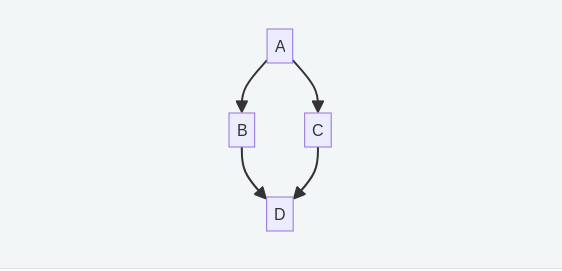

# Utilizing parallelism on Zest

Slurm's strength is in running lots of jobs simultaneously, in parallel, from
single-core tasks up to programs that span many nodes.  Sometimes research
naturally fits into this pattern, such as a study that explores 100 different
sets of parameters and can run each set independently.  In other cases the
problem may not divide up as simply, but even then there are general techniques
that can be used to split a single large or slow program into smaller parts.

A common issue that arises when considering how to split up such a program is
how data should be managed.  If a program utilizes global data structures that
can change during the program's run then data management becomes much more
difficult since different parts or steps of the code must be aware of each other
and somehow coordinate their access to these structures.  This document
therefore focuses on techniques adapted from
[functional programming](https://en.wikipedia.org/wiki/Functional_programming).

While a full discussion of this topic is outside the current scope, readers may
wish to familiarize themselves with some of the ideas for application in their
own work, even when not using a purely functional language or style.  Here we
will focus on two very general and powerful techniques *map* and *reduce*.


## Map: changing data

To start, consider the simple problem of squaring every value in an array of
integers.  In Python this might naively be done as

```python
initial_array = [1,2,6,12,18]
new_array = []

for value in initial_array:
    new_array.append(value * value)
```

This represents a standard programming construct, iterating over some collection
of values and doing something with each.  This can be written more compactly and
more in keeping with the "Python style" by using a *list comprehension*.

```python
initial_array = [1,2,6,12,18]
new_array = [v * v for v in initial_array]
```

In this case the list comprehension is equivalent to using Python's
[map](https://docs.python.org/3.13/library/functions.html#map) function.  Map
applies a function to every element of an array.  In order to do that the first
argument to map is itself a function.  For some readers the idea of passing a
function to another function may seem weird, but in Python a function is just a
"thing" like any other "thing" such as an integer or string.  A function can
take a function as an argument or return a new function, just as a function can
take a string as an argument or return a new string.  This ability to treat
functions as *first-class objects* is a key insight from functional programming.

The code written using map looks like this:

```python
def square(v):
    return v*v

initial_array = [1,2,6,12,18]
new_array = map(square, initial_array)
```

There is still one difference between functions and other types here.  Generally
it is not necessary to give something a variable name before using it.  The
first array could be totally eliminated by writing it as

```python
def square(v):
    return v*v

new_array = map(square, [1,2,6,12,18])
```

So if functions are treated the same as anything else it should be possible to
create one without giving it a name.  This is done through the *lambda* keyword
(the name comes from [lambda
calculus](https://en.wikipedia.org/wiki/Lambda_calculus), a mathematical
formulation of functional programming).

```python
new_array = map(lambda v: v*v, [1,2,6,12,18])
```

This is about as far as we'll go into functional programming!

The key thing to notice here is that every element of `new_array` is calculated
independently.  So rather than doing the first, then the second, and so on why
not do them all at once, in parallel.  Even before bringing in Slurm the work
can be split among several CPUs.  In Python the built-in
[multiprocessing](https://docs.python.org/3.13/library/multiprocessing.html#module-multiprocessing)
module makes this easy.

```python
from multiprocessing import Pool

number_of_cpus = 5

with Pool(number_of_cpus) as p:
     new_array = p.map(lambda v: v*v, [1,2,6,12,18])
```

Just replace `map` with `Pool.map`.  In a situation where the function is very
slow this can enable the program to run in almost one fifth of the time!

To run a program like this under Slurm it is also necessary to tell the
system how many CPUs the program will need.  This is done with the
`--cpus-per-task` option in the batch script.

```bash
#!/bin/bash
#SBATCH --cpus-per-task=5

python3 squares.py
```

Slurm sets the environment variable `SLURM_CPUS_PER_TASK` inside the job, so
rather than hard coding `number_of_cpus = 5` the program can read it with
`int(os.environ.get("SLURM_CPUS_PER_TASK", 1))` and the batch script becomes
the single place where the size of the job is decided.  The nodes on Zest
have between 64 and 336 cores, so this approach alone can go a long way.


### Multiple arguments

In this example the square function only needs one value, but what if the
problem requires multiplying the values in two arrays?

```python
array1 = [2,3,4,5]
array2 = [5,6,7,8]
result = []

for i in range(len(array1)):
    result.append(array1[i] * array2[i])
```

As the saying goes, when all you have is a hammer everything looks like a nail.
If all you have is a way of dealing with functions that take only one argument,
then make all your data look like a single value!  In this case two lists can
be transformed into one list of two values with the zip function

```python
print(list(zip(array1, array2)))

[(2,5), (3,6), (4,7), (5,8)]
```

This can now be used in `map`:


```python
from multiprocessing import Pool

def multiply(values):
    v1, v2 = values
    return v1*v2

array1 = [2,3,4,5]
array2 = [5,6,7,8]

number_of_cpus = 5

with Pool(number_of_cpus) as p:
     result = p.map(multiply, list(zip(array1, array2)))
```

Or more compactly using a lambda expression

```
     result = p.map(lambda v: v[0]*v[1], list(zip(array1, array2)))
```


### Mapping over values with job arrays

Although Slurm doesn't exactly have a map function it does provide a
mechanism, the *job array*, which can be thought of as doing the same thing.
To start with, in moving from a single program to a batch of jobs, functions
get replaced by programs.  Arguments to the function become command-line
arguments, and instead of returning a value the result is printed.

```python
def multiply(values):
    v1, v2 = values
    return v1*v2
```

Becomes

```python
# multiply.py
import sys

v1 = int(sys.argv[1])
v2 = int(sys.argv[2])

print(v1 * v2)
```


The set of arguments gets stored in an auxiliary file, in this case called
`values.dat` containing the zipped pairs

```
2 5
3 6
4 7
5 8
```

Then the batch script ties everything together and does the mapping

```bash
#!/bin/bash
#SBATCH --array=1-4
#SBATCH --output=result_%a.dat
#SBATCH --error=multiply_%a.err

read -r arg1 arg2 <<< "$(sed -n "${SLURM_ARRAY_TASK_ID}p" values.dat)"

python3 multiply.py $arg1 $arg2
```

`--array=1-4` asks for four copies of the job.  The variable
`SLURM_ARRAY_TASK_ID` is handled by Slurm, it is automatically set to 1 for the
first job, 2 for the second and so on, and `%a` in the file names is replaced
by the same number.  The `sed` line picks the matching line out of
`values.dat`.  Note that here the `--cpus-per-task` line isn't necessary.  Each
instance of `multiply.py` uses only one CPU, the parallelisation is managed by
Slurm running one of these instances for each line in `values.dat`.  When the
batch completes the results will be scattered across files called
`result_1.dat`, `result_2.dat` etc.  It is possible to have Slurm combine all
the results into one file after all the jobs have run, that will be discussed
in a section below on job *dependencies*.  The [multipleJobs](../multipleJobs)
example is a ready-to-run version of exactly this pattern.


# Reduce: Combining a set of values into one result

Next, consider the problem of adding up a list of values

```python
values = [1,2,4,7,12]

total = 0

for value in values:
    total = total + value
```

This is an example of a general *reduce* pattern that, once you start looking
for it, turns up everywhere.

```python
values = ...

accumulator = an_initial_value

for value in values:
    accumulator = some_function(accumulator, value)
```

The pattern is sometimes hidden, for example, consider an array that contains
values from 0 to 9 and we want to generate a count of how many times each number
appears

```python
values = ...

accumulator = [0,0,0,0,0,0,0,0,0,0]

for value in values:
    accumulator[value] += 1
```

While the step inside the loop doesn't seem to have the right form this is
because in Python, as in most languages, data structures and variables are
*mutable*, they can be changed over the course of the computation.  This not
only hides the reduce pattern but makes it harder to think about parallelism,
again because if different threads of execution are modifying a data structure
at the same time they might not happen in the right order, or might overwrite
each other.  This is another instance where thinking functionally can help,
because in functional languages data structures and variables can not be changed
once created.  In this case that means that we'll have to create a new array
each time through the loop.

```python
def increment_counter(array, index_to_increment):
    return [index == index_to_increment and value+1 or value for index,value in enumerate(array)]

values = ...

accumulator = [0,0,0,0,0,0,0,0,0,0]

for value in values:
    accumulator = increment_counter(accumulator, value)
```

Now this fits the general pattern.  This is so common that Python even supplies
a function, [functools.reduce](https://docs.python.org/3/library/functools.html#functools.reduce),
to encapsulate it.  The previous example is equivalent to


```python
from functools import reduce

def increment_counter(array, index_to_increment):
    return [index == index_to_increment and value+1 or value for index,value in enumerate(array)]

values = ...

accumulator = reduce(increment_counter, values, [0,0,0,0,0,0,0,0,0,0])
```

## Parallelizing reduce operations

Although there is no built-in `pool.reduce` method we can still think about how
such operations could be parallelized.  Going back to the example of summing up
a list, one obvious thing we could do is reduce each half of the array
separately, possibly in parallel, and then adding the results

```python
from functools import reduce
from operator import __add__

values = ...

middle_index = len(values)//2

result = reduce(__add__, values[:middle_index], 0) + \
         reduce(__add__, values[middle_index:], 0)
```

The number of parallel reductions could be changed based on the size of the
problem and the number of available CPUs.


## A subtlety and some math

This section can be skipped but is provided for anyone who might find this a useful way
to think about things.

Extending the idea of splitting into multiple reduce calls to the histogram example
would require an auxiliary function to combine the partial results

```python
from functools import reduce

def increment_counter(array, index_to_increment):
    return [index == index_to_increment and value+1 or value for index,value in enumerate(array)]

def add_arrays(arr1, arr2):
    return [v[0] + v[1] for v in zip(arr1, arr2)]

values       = ...
middle_index = len(values)//2

accumulator1 = reduce(increment_counter, values[:middle_index], [0,0,0,0,0,0,0,0,0,0])
accumulator2 = reduce(increment_counter, values[middle_index:], [0,0,0,0,0,0,0,0,0,0])
accumulator  = add_arrays(accumulator1, accumulator2)
```

This is because, in general, the type of the accumulator (here `list[int]`) is different
from the type of the elements of the values list (in this case `int`).  It can be easier
to reason about reductions when they're the same, because this means that combining the
intermediate reductions is *itself* a reduction!

Consider a list of 40 elements to be added together, split into 4 pieces.  Each piece can be
reduced independently, then the total is one last reduce.

```python
results = [reduce(__add__, values[ 0:10], 0),
           reduce(__add__, values[10:20], 0),
           reduce(__add__, values[20:30], 0),
           reduce(__add__, values[30:40], 0)]

result = reduce(__add__, results, 0)
```

There's an elegant way to express when this is possible.

A *monoid* is a set, denoted `S` and an operator denoted `•` with the
following properties:

  * For all elements *a* and *b* in `S`, *a • b* is also an element of `S`
  * There is an special element called the identity denoted `e` such that,
    for all *a* in `S` *a • e = e • a = a*
  * The operator is associative, for all *a,b,c* in `S`,
    *(a • b) • c = a • (b • c)*.  This means we can ignore parenthesis.

Note that it is *not* necessary that *a • b = b • a*.

Some examples:

  * Integers with addition, the identity element is 0
  * Strings with string concatenation, the identity element is the empty string ""
  * Booleans with `and`, the identity element is `True`

Employing this language we can say that reduce operations have the simplest and
most flexible form when operating on a monoid.  In pseudo-Python

```python
values : List[S] = ...
identity : S = ...

result = reduce(•, values, identity)
```

If the problem isn't intrinsically in this form it can sometimes be possible
and useful to first convert the elements in the `values` array to the type of
the accumulator, which can often be done via `map`.  For the histogram example:

```python
from functools import reduce

def value_to_array(value):
    return [index == value and 1 or 0 for index in range(0,10)]

def add_arrays(arr1, arr2):
    return [v[0] + v[1] for v in zip(arr1, arr2)]

values        = ...
monoid_values = list(map(value_to_array, values))
middle_index  = len(values)//2

accumulator1 = reduce(add_arrays, monoid_values[:middle_index], [0,0,0,0,0,0,0,0,0,0])
accumulator2 = reduce(add_arrays, monoid_values[middle_index:], [0,0,0,0,0,0,0,0,0,0])
accumulator  = add_arrays(accumulator1, accumulator2)
```

This now has exactly the same form as the list summation example.


# Structuring Slurm jobs with dependencies

As we move into more complex combinations of map and reduce we'll need a
mechanism to structure the whole computation workflow.  As an example, when
splitting a reduction into several pieces we need to first do each of the
sub-reductions, then combine them into the final result.  Slurm provides
this through the `--dependency` option of `sbatch`, which tells a job not to
start until other jobs have reached some state.

Consider a job A that sets up some data, jobs B and C which process that data
in parallel, and then a final job D that combines the result.  This
relationship looks like



The corresponding commands are

```bash
A=$(sbatch --parsable A.sh)
B=$(sbatch --parsable --dependency=afterok:$A B.sh)
C=$(sbatch --parsable --dependency=afterok:$A C.sh)
D=$(sbatch --parsable --dependency=afterok:$B:$C D.sh)
```

`--parsable` makes `sbatch` print just the job ID so that it can be captured
in a shell variable, and `afterok:<id>` means "start after job <id> has
finished successfully".  Several IDs can be listed separated by colons.  All
four jobs are submitted immediately and appear in `squeue`, with B, C and D
shown as pending with the reason `(Dependency)` until their turn comes.

Other useful dependency types are

  * `afterany:<id>`, start once the job has finished whether or not it
    succeeded, useful for clean-up steps.
  * `afternotok:<id>`, start only if the job failed, for example to send a
    notification or retry.
  * `singleton`, start only when no other job with the same name is running,
    a simple way to make a series of jobs run one at a time.

If a job in the chain fails its `afterok` dependents can never start.  They
stay in the queue with the reason `(DependencyNeverSatisfied)` and must be
removed with `scancel`.

## Map with dependencies

In this model a map operation is simply a set of jobs with no dependencies
between them, and as discussed above the cleanest way to express it is a
single job array.  The Python program `square.py` in this directory squares
its argument

```python
import sys

n = int(sys.argv[1])
print(n * n)
```

and `square.sh` runs it once per array task, taking its value from the
`VALUES` environment variable, so that

```bash
VALUES="6 10 23" sbatch --array=0-2 square.sh
```

produces `output/square_0.out`, `output/square_1.out` and
`output/square_2.out`.

## Reduce with dependencies

Here things start to get a little more complicated.  We'll need one job for each
sub-reduce operation, these will act as the parent to a job that combines the results.
For the example of summing a list of numbers, `add.py` takes as arguments the
names of files containing numbers and prints their sum, and `add.sh` is a
batch script that runs it with whatever arguments are given to `sbatch`

```bash
#!/bin/bash
#SBATCH --job-name=add
#SBATCH --output=output/%x_%j.out

python3 add.py "$@"
```

Each task of a job array has an ID of the form `<array job>_<task>` which can
be used in a dependency, so summing the three squares above would be

```bash
sbatch --dependency=afterok:${ARRAY}_0:${ARRAY}_1:${ARRAY}_2 \
       add.sh output/square_0.out output/square_1.out output/square_2.out
```

(or `afterok:${ARRAY}` on its own to wait for the whole array).  Here's where
we can use the fact that integers under addition form a monoid to make things
easy!  To combine partial sums we just need to run `add.sh` again on the
files that the first round of `add.sh` jobs produced.


# Putting it together: adding up a list of squares

As the last section showed, the chains of `sbatch` commands can get long
quickly even for simple tasks.  Users will rarely type these by hand, instead
usually a program is used to generate and submit the jobs based on the "shape"
of the data, for example the length of a list to be processed.

This directory includes a `submit_workflow.py` example, it takes a list of
numbers as arguments.  Each number is squared in a separate map task, then the
total is computed by splitting the list into groups of five numbers.  This
splitting is hierarchical, if asked to work on 10 numbers there will be 10 map
tasks and three reduce jobs (one for the first five numbers, one for the second
five numbers, and one for the resulting two numbers).  If asked to work on 35
numbers there will be 35 map tasks and 9 reduce jobs (one for each initial group
of 5 numbers making a group of 7, one for the first five in this new group and
one for the last two in the new group, giving another new group of 2, and then
one last one adding these final two).

You can see it in operation with, for example

```bash
python3 submit_workflow.py 1 2 3 4 5 10 11
```

which prints

```
map:    array job 3127711 with 7 tasks
reduce: level 1, 2 add job(s)
reduce: level 2, 1 add job(s)
final:  job 3127715 will write output/FINAL.out
```

Watch the jobs move through the queue with `watch -n 5 squeue --me`.  After
they have all run the result, 276, will be in `output/FINAL.out`.  The
intermediate results are in `output/square_*.out` and `output/add_*.out`.

The core of the script is just a loop that submits `add.sh` for each group of
pending results with a dependency on the jobs that produce them, and
collects the new job IDs for the next round:

```python
while len(pending) > 1:
    groups  = [pending[n:n + 5] for n in range(0, len(pending), 5)]
    pending = []
    for group in groups:
        depends = "afterok:" + ":".join(job for job, _ in group)
        files   = [name for _, name in group]
        job     = sbatch(f"--dependency={depends}", "add.sh", *files)
        pending.append((job, outfile))
```

The whole workflow is submitted in a second or two and Slurm takes care of the
ordering from then on, there is no need to keep a program running or stay
logged in.  For workflows that are more complex than this, or that need to
react to results as they arrive, see the [Snakemake](../Snakemake) and
[NextFlow](../NextFlow) examples.


## Conclusion: thinking parallelly

As a final example let's look at matrix multiplication.  As a reminder from
Wikipedia [matrix multiplication](https://en.wikipedia.org/wiki/Matrix_multiplication) is defined as:

If _A_ is an m × n matrix and _B_ is an n × p matrix,


the matrix product _C = AB_ (denoted without multiplication signs or dots) is defined to be the m × p matrix


such that


In straightforward Python code this would be implemented as follows
(note that the order of the indices is correct, in
mathematical notation A<sub>i,j</sub> means the i'th row  and j'th
column, whereas in Python `A[i][j]`  it's the same)

```python
A = [[1,2,3],
     [4,5,6],
     [7,8,9]]

B = [[2,4,6],
     [1,3,5],
     [9,8,7]]

C = [[0 for _ in range(len(A[0]))] for _ in range(len(B))]

for i in range(len(A)):
    for j in range(len(B[0])):
        for k in range(len(B)):
            C[i][j] += A[i][k] * B[k][j]
```


As a general rule, whenever a program has a loop there's likely to be a candidate
for parallelization, if a value is being modified on each iteration then there may
be an opportunity to use reduce, and if not then there may be an opportunity for map.

Looking at the innermost loop over `k`, there are two patterns we've seen before;
the product of two lists, and a sum over a list.  This suggests rewriting as

```python
from functools import reduce
from operator import __add__

A = [[1,2,3],
     [4,5,6],
     [7,8,9]]

B = [[2,4,6],
     [1,3,5],
     [9,8,7]]

C = [[0 for _ in range(len(A[0]))] for _ in range(len(B))]

for i in range(len(A)):
    for j in range(len(B[0])):
        pairs    = [(A[i][k], B[k][j]) for k in range(len(B))]
        products = map(lambda v:v[0]*v[1], pairs)
        C[i][j]  = reduce(__add__, products, 0)
```

At the outer level there are nested loops over i and j, and certainly this could
be turned into nested calls to map.  However in this case it makes things somewhat
simpler to note that the effect of these loops is to iterate over all combinations
of i and j, that is, all pairs of (i,j).

```python
indices = [(i,j) for i in range(len(A)) for j in range(len(B[0]))]

for i,j in indices:
    pairs    = [(A[i][k], B[k][j]) for k in range(len(B))]
    products = map(lambda v:v[0]*v[1], pairs)
    C[i][j]  = reduce(__add__, products, 0)
```

This now looks a little more like previous map examples, although with one
difference.  Previous examples have transformed the values in one list into
values in the result,

```python
def isEven(x):
    return x % 2 == 0

maybeEven = map(isEven,[1,2,3,4])
```

turns a list of ints into a list of bools.  In this case however
what is being transformed is the list of index pairs *in the context of A and B*.
This isn't a huge difference, but it does mean that the context needs to be
included in the map.

```python
def handleOneEntry(A, B, index):
    i,j      = index
    pairs    = [(A[i][k], B[k][j]) for k in range(len(B))]
    products = map(lambda v:v[0]*v[1], pairs)

    return reduce(__add__, products, 0)

indices = [(i,j) for i in range(len(A)) for j in range(len(B[0]))]
entries = map(lambda index: handleOneEntry(A, B, index), indices)
```

There is then just one final step, `entries` will contain a single
list where we want C to be a list of lists representing a matrix.
Adding this gives the final version of the program.

```python
from functools import reduce
from operator import __add__

A = [[1,2,3],
     [4,5,6],
     [7,8,9]]

B = [[2,4,6],
     [1,3,5],
     [9,8,7]]

def handleOneEntry(A, B, index):
    i,j      = index
    pairs    = [(A[i][k], B[k][j]) for k in range(len(B))]
    products = map(lambda v:v[0]*v[1], pairs)

    return reduce(__add__, products, 0)

indices = [(i,j) for i in range(len(A)) for j in range(len(B[0]))]
entries = list(map(lambda index: handleOneEntry(A, B, index), indices))
C       = [[entries[i*len(B[0])+j] for j in range(len(B[0]))] for i in range(len(A))]
```

Although functional programs can often be both more concise and easier to
understand than their imperative or object-oriented alternatives it would be
hard to argue that that is the case here!  However, this does position the code
to be run efficiently on the cluster, each entry of C could be one task of a
job array, and although this example is rather artificial in real code these
kinds of code transformations can reduce the run time of a program from days
to under an hour.

## A note on MPI

Everything above splits work into independent jobs that never talk to each
other, which is the simplest and most robust kind of parallelism and should
be the first thing to try.  Programs whose parts need to exchange data while
running, such as simulations where each process holds part of a grid, use
[MPI](../MPI) instead, and Slurm supports both styles equally well.

---
Please email any questions or comments about this document to Research Computing at [researchcomputing@syr.edu](mailto:researchcomputing@syr.edu).
